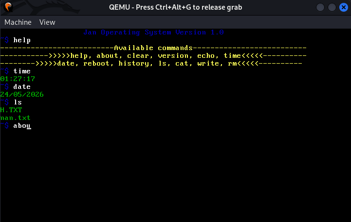
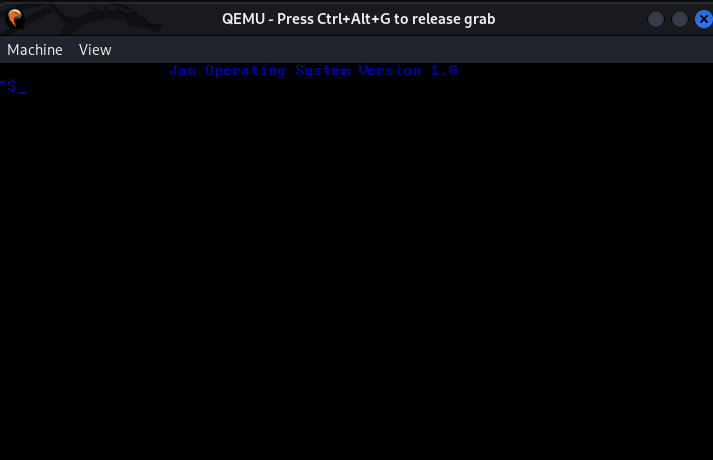

# JanOS

A 32-bit x86 operating system built from scratch in C and x86 Assembly.

## Features

- Custom bootloader
- 32-bit protected mode
- Shell commands + uptime
- FAT12 filesystem support
- Disk read/write support
- Persistent storage via ATA driver
- Memory management and paging
- Hardware cursor
- Keyboard with shift support
- History navigation with arrow keys
- Screen Scrolling
- Timer and keyboards interrupt working 

## Commands

- ls - list files
- cat - read files  
- write - create files
- rm - delete files
- time - show current time
- date - show current date
- history - show command history
- echo - print text
- reboot - restart system
- help - show all commands
-uptime - show how long the system has been running since boot 

## Requirements
- NASM
- GCC
- LD
- QEMU
- mtools

## Build

Install requirements:
```bash
sudo apt install nasm gcc binutils qemu-system-x86 mtools

```bash
# Makefile
make
make run
make clean

##Screenshot





## License

Copyright (C) 2026 Gyimah-Benjamin

Licensed under the GNU General Public License v3.0.
